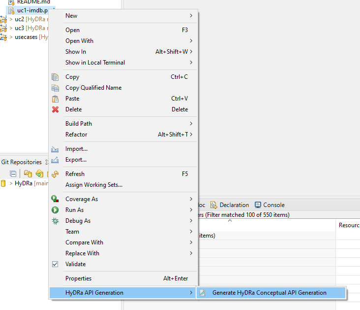
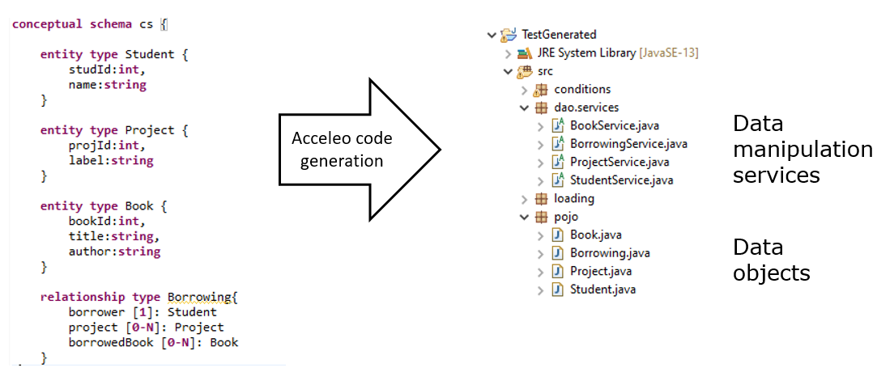

# HyDRa
HyDRa (Hybrid Data Representation and Access) is a hybrid polystore management framework providing a modeling language and a conceptual API generation tool.

## Install

**A [video](https://github.com/gobertm/HyDRa/raw/main/Use-Cases/resources/Video-Installation-Usage.mp4) of the installation and usage of HyDRa tools is available**

-   Make sure Java 14 is installed on your computer
-   Run Eclipse and install the HyDRa plugins
    -   Help > Install New Software > Add > https://staff.info.unamur.be/gobertm/
-   Restart Eclipse. (Note that in some cases the API generation tool requires a second restart of Eclipse)

## Usage
-   Create a new Maven project or import a pre-existing project in [Use-Cases](Use-Cases/) folder.
    -   Please make sure Eclipse uses the Java 14 compiler. Properties > Build path > Select Java 14 JRE. 
    And Properties > Java Compiler > Compiler Compliance Level.
-   Design your HyDRa polystore schema. Create New File > *.pml file extension.
-   Generate the conceptual API code by right-clicking on the .pml file > HyDRa API Generation > Generate HyDRa Conceptual API. Note that if no file is generated, it may be necessary to restart Eclipse and to try again.

## Use-Cases 

-   [uc1-imdb](Use-Cases/uc1-imdb) is a complete use case illustrating all functionalities and benefits of the HyDRa framework.
-   [uc2-datainconsistency](Use-Cases/uc2-datainconsistency) is a use case focusing on the data inconsistency discovery feature of HyDRa.
-   [uc3-hybridrelation](Use-Cases/uc3-hybridrelation) further illustrates the handling of hybrid data model references.

## Design of polystore

The HyDRa polystore modeling language was written using Xtext, see [Concrete Syntax](be.unamur.polystore.parent/be.unamur.polystore/src/be/unamur/polystore/Pml.xtext)
Below we provide an instantiation example of the three main sections of a HyDRa polystore schema:
1.  The Conceptual Schema section represents the application domain model of the polystore;
2.  The Physical Schema section allows the definition of the physical data structures;
3.  The Mapping Rules section expresses the links between conceptual schema elements and physical schema elements.

 

## API Generation

The HyDRa framework also includes a conceptual access API generation process.
A HyDRa polystore schema is given as input of this process. The generation itself is implemented using an Acceleo-based tool (see [acceleo sources](be.unamur.polystore.parent/be.unamur.polystore.acceleo)) which generates object classes and data manipulation classes. The API generation tool can be launched by right-clicking on a .pml HyDRa polystore schema.

