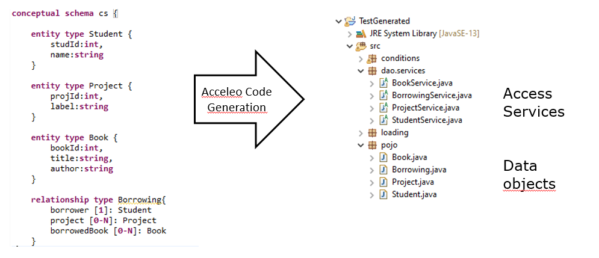

# HyDRa
HyDRa (Hybrid Data Representation and Access) is a hybrid polystore management framework providing a modeling language and a conceptual API generation tool.

## Install

-   Make sure to have Java 14 installed
-   Run Eclipse and install HyDRa plugins
    -   Help > Install New Software > Add > https://staff.info.unamur.be/gobertm/
-   Restart Eclipse. (Note that in some cases the API generation need a second Eclipse restart)

## Usage
-   Create New Maven project or import pre existing ones in [Use-Cases](Use-Cases/) folder.
    -   Please make sure to use Java 14 compiler. Properties > Build path > Select Java 14 JRE. 
    And Properties > Java Compiler > Compiler Compliance Level.
-   Design HyDRa Polystore schema. Create New File > *.pml file extension.
-   Generate API Code by right clicking on a .pml file > HyDRa API Generation > Generate HyDRa Conceptual API. Note that if no files are generated it may be necessary to restart Eclipse.

## Use-Cases 

-   [uc1-imdb](Use-Cases/uc1-imdb) is a complete use case illustrating all functionalities and benefits of HyDRa framework.
-   [uc2-datainconsistency](Use-Cases/uc2-datainconsistency) is a use case focusing on the data inconsistency discovery feature of HyDRa.
-   [uc3-hybridrelation](Use-Cases/uc3-hybridrelation) illustrates further the hybrid data model referencing handling.

## Design of polystore

HyDRa polystore model language was written using Xtext, see [Concrete Syntax](be.unamur.polystore.parent/be.unamur.polystore/src/be/unamur/polystore/Pml.xtext)
Below is an example of the three main parts of a HyDRa polystore schema. 
It is made of three main sections :
1.  Conceptual schema representing the application domain model
2.  Physical schema section, allowing the definition of physical data representation
3.  The Mapping Rules which are the expression of the link between conceptual and physical elements.

 

## API Generation

HyDRa comes with a conceptual access API code generation.
A HyDRa polystore schema is the input of our Acceleo code (see [acceleo sources](be.unamur.polystore.parent/be.unamur.polystore.acceleo)) which generates object classes and data manipulation classes.

Right clicking on .pml HyDRa polystore schema allows the generation.

