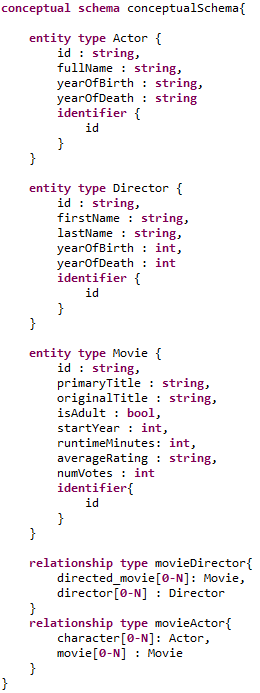
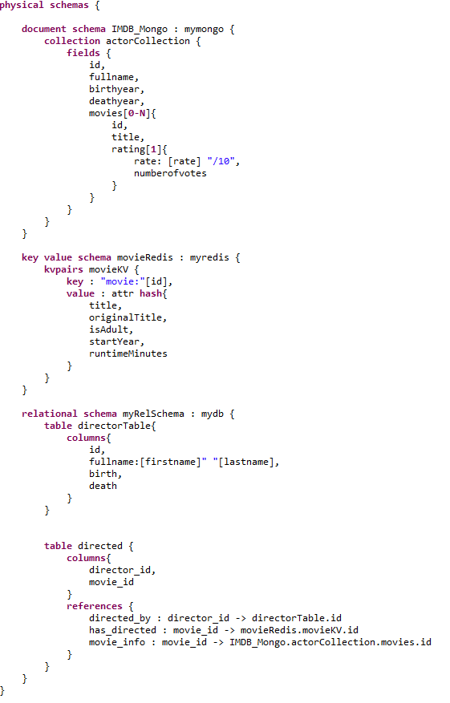

# Example Use Case

## IMDB
### **How-to**
-   Run 'docker-compose up' . To deploy databases and data. This may take a few minutes ~10. It's done when mysql docker has succesfully run *3-directorTable.sql*
-   Play with API and Data in [Test Class](https://github.com/gobertm/HyDRa/blob/main/Use-Cases/uc1-imdb/src/test/java/IMDBTests.java)

### **Description**
This use case is the one presented in our submitted paper.
It is based on a subset of IMDB movie data https://www.imdb.com/interfaces/.
Below are detailed description of conceptual, physical schemas and mapping rules.
Key points are :
- *actorCollection* in **IMDB_Mongo** document database, contains all actors with an embedded array *movies* of their 3 most known movies (data coming from *knownForTitles* of **name.basics.tsv** IMDB file)
- *movies* array elements have an embedded object of randomly generated ratings info. 
- **movieRedis**, key value database, contains movie data only for 2010 release date movies. 
- **movieRedis** is the only database containing *originalTitle*, *isAdult*, *startYear* and *runtimeMinutes* movie attributes.
- *fullname* column in *directorTable*, relational database is composed field made of concatenation of *firstname* and *lastname* attributes.
- Join table *directed*, between *director* and *movies* contains two columns used by three references/foreign keys. *director_id* references another table in the same database.
*movie_id* references movie info in **IMDB_Mongo** and **movieRedis** 

### **Results** 

- [testGetAllMovies](https://github.com/gobertm/HyDRa/blob/267cad53c515d85506eb3eecbbddc5124208ae6d/Use-Cases/uc1-imdb/src/test/java/IMDBTests.java#L28) returns all *Movie* objects found in all databases. It builds a complete conceptual object *Movie* object, joining from embedded array structures of **actorCollection** and **movieRedis** key value structure.
Retrieved dataset of *Movie* objects can be split in two parts.
1. Movies of 2010, which are also contained in redis key value databases, have values for all conceptual attributes.
 
2. Other movies only have attributes values found in *actorCollection* 

- [testGetActorByMovieDirector](https://github.com/gobertm/HyDRa/blob/267cad53c515d85506eb3eecbbddc5124208ae6d/Use-Cases/uc1-imdb/src/test/java/IMDBTests.java#L40) is a complete example of how one can retrieve a set of Actor who played in film directed by a particular Director.
Main steps are :
1.  Build a condition object, expressing specific values for *Director*'s attributes.
2.  Querying director data based on this condition.
3.  Retrieving the *Movie*s objects of this particular Director by exploiting the declared conceptual relationship *movieDirector* , and particularly the role *directed_movie*.
4.  For each of this movies, retrieving the *Actor*s, using *character* role of *movieActor* relationship.
### Conceptual Schema 

### Physical Schema

### Mapping Rules

